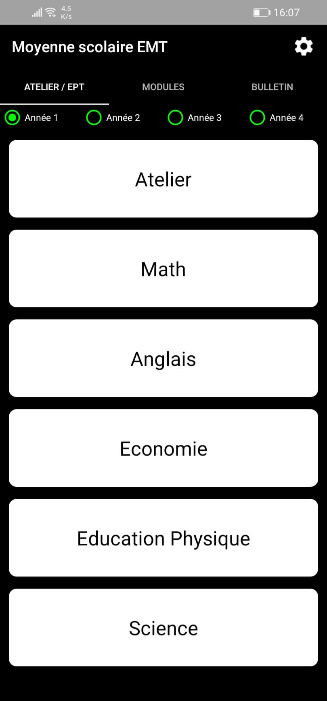
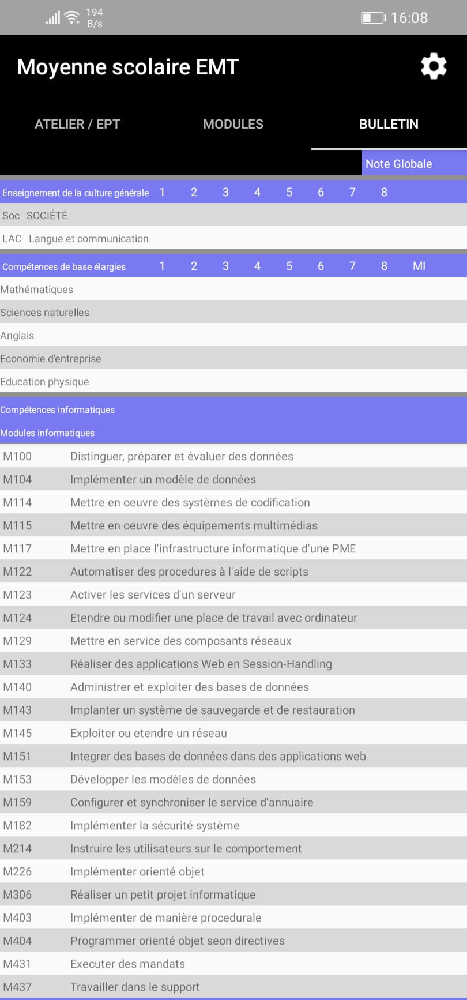

# Android application for computer scientist apprentices, technicals works school at Porrentruy, JU, Swizerland. 

preview 1        | preview 2
:-------------------------:|:-------------------------:
 | 

## Requirements :
- Android >= 6.0
- 2.5 Mb free

## Installation
1. Download the apk on your Android phone
2. Install the apk
3. If require, allow installation from untrusted sources
4. Enjoy

No permissions are required by the app to work.
